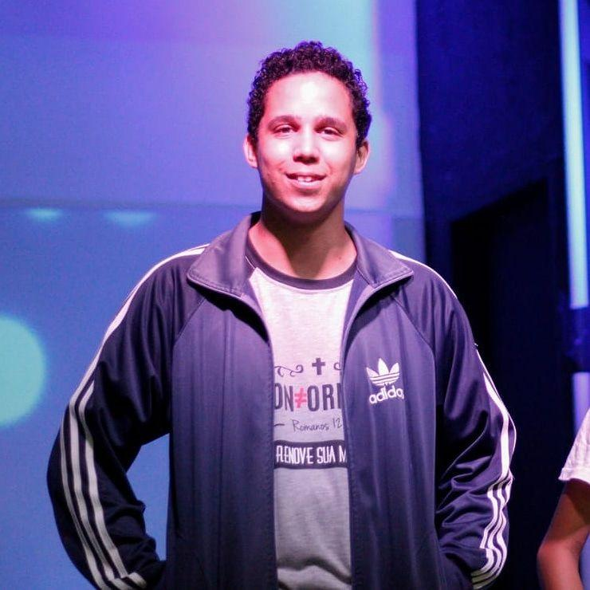

## Hi there 👋 

- I am a Computer Science student. 💻
- Currently focused on Android Development. 📱
- I like design user interfaces and create web/mobile 
apps. 💟
- From Brazil. 🇧🇷

  
Language & Tools 🔧

   
  
<i>List of languages and frameworks that I have worked</i>

  <ul>
    <li>Flutter/Dart</li>
    <li>Kotlin</li>
    <li>HTML/CSS/JS(ES6)/React/Bulma</li>
    <li>Python</li>
    <li>SQL</li>
  </ul>
    

  
Projecs & Experiments 🧪

   
  
<i>List of personal/group projects and tests!</i>

  <ul>
    <li><a href="https://jrcodev.github.io/ETIB/"> ETIB: Event: Made with BulmaCSS and Sass </a></li>
    <li><a href="https://github.com/jrcodev/dafontdownloader">A font downloader cliente made with Python.</a></li>
  </ul>
    

  <i>Contact me!</i>
  

    
    
    
  

